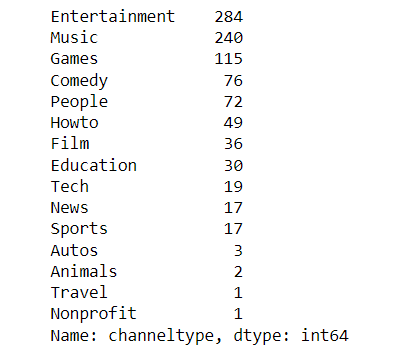

# Top 1000 ChannelType using Python

YouTube maintains a list of the top YouTube channels on the platform. This projects shows the data of top 1000 Youtube channels and channeltypes.
## Acknowledgements

 - Assessment 4
 - YoutubeDataset


## Used By

This project is used by the following:

- Data 1202-02 - Data Analysis Tools Analytics 
- Data 1202-02 - Assessment 5


## Tech Stack

Python Programming

## Deployment

To deploy this project run

```bash
  import pandas as pd
```
```bash
import matplotlib.pyplot as plt
```

## Screenshots





# Hi, My name is Bankole! 👋


## 🚀 About Me
I'm a student of Durham College. I am currently taking my post graduate program in Data Analytics...


## 🛠 Skills
Python, R Sudio, Tableau, Microsoft Office, SQL...


## 🔗 Links
[](https://katherinempeterson.com/)
[](https://www.linkedin.com/)
[](https://twitter.com/)

